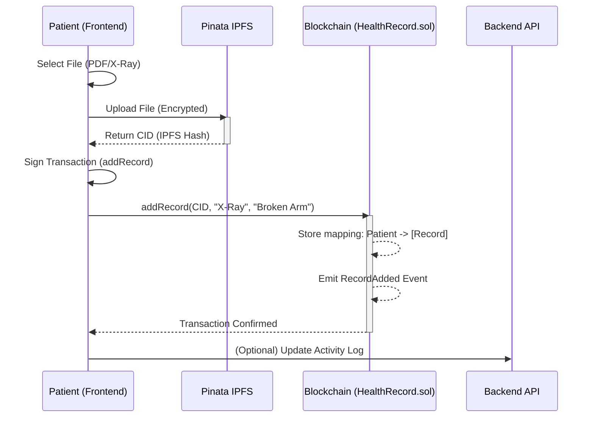
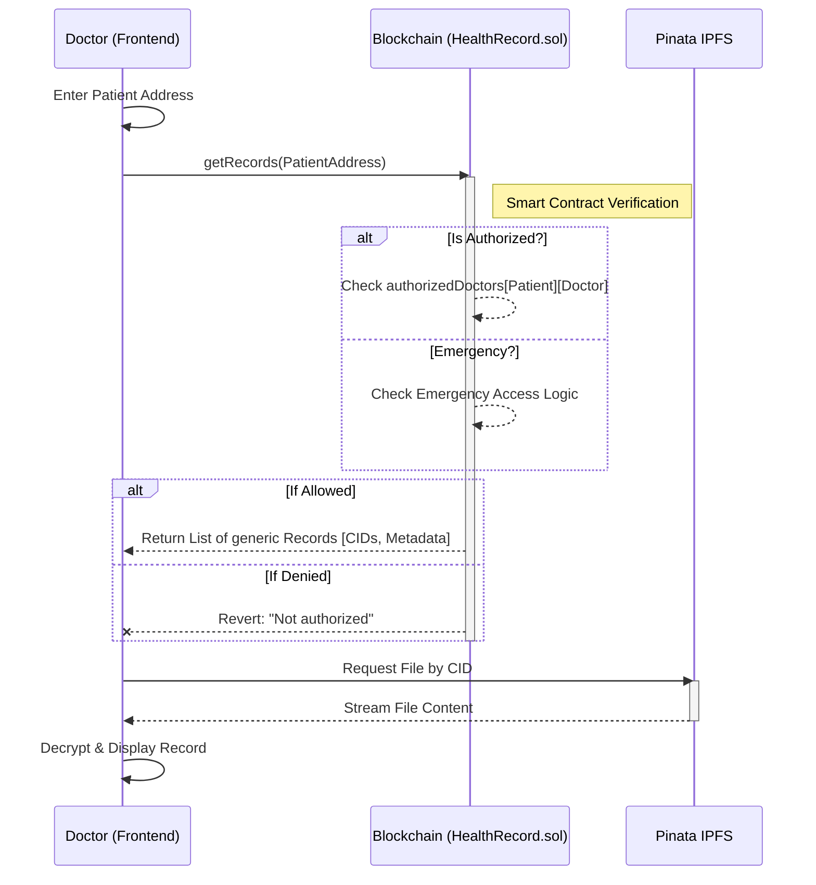
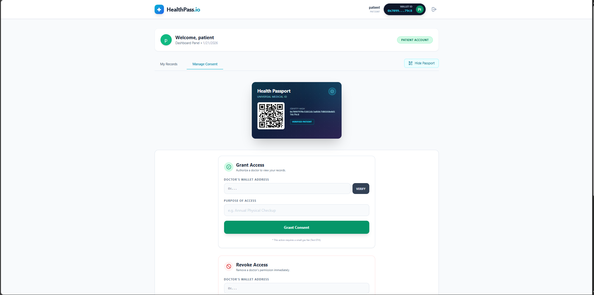
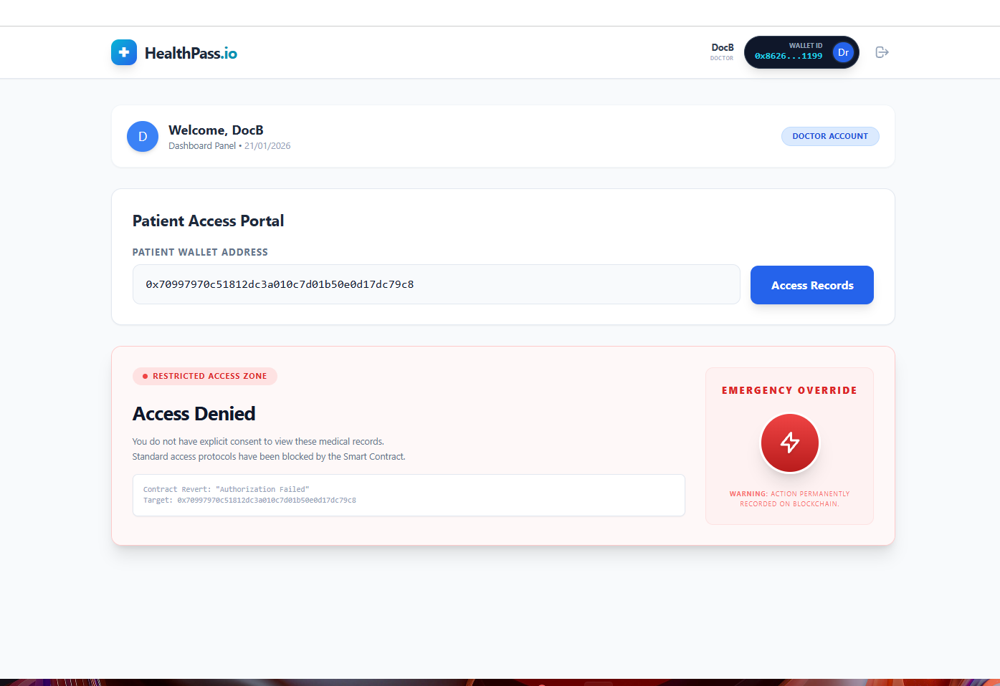
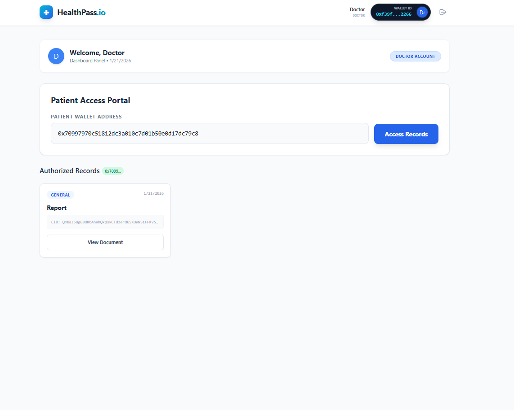

# 🏥 Consent-as-Code + Health Passport  

### Secure Patient Health Data Exchange  

Built for **RUBIX'26 Hackathon** — Team *TryHards*

> *UPI for medical data — except the patient is the bank.*

A decentralized health data exchange system that gives patients **true ownership** of their medical records through **programmable consent enforced by smart contracts**. The system enables secure sharing of health data across hospitals, diagnostic labs, emergencies, and insurance providers — without blind trust.

---

## 📑 Table of Contents

- [Brief Description](#brief-description)
- [Tech Stack](#tech-stack)
- [System Architecture](#system-architecture)
- [Key Terminologies](#key-terminologies)
- [Problems with Traditional Systems](#problems-with-traditional-systems)
- [How Our System Improves Healthcare Data Exchange](#system-improvements)
- [System Workflow](#system-workflow)
- [Key Features](#key-features)
- [Screenshots](#screenshots)
- [Developer Guide (Setup)](#developer-guide)

---

<a id="brief-description"></a>

## 📌 Brief Description

Traditional healthcare systems store patient data in siloed, centralized databases with limited transparency and weak consent mechanisms. This project introduces **Consent-as-Code**, where access rules are written directly into smart contracts.

Patients control:

- **Who** can access their data  
- **What** data can be accessed  
- **For how long** it can be accessed  

Medical files are stored off-chain using IPFS, while consent logic, access verification, and audit trails are permanently recorded on the blockchain.

---

<a id="tech-stack"></a>

## 🛠️ Updated Tech Stack (2026-Ready)

### 🧠 Core Blockchain Stack

#### 🔹 Smart Contracts

- **Solidity ^0.8.23** (Latest stable, built-in overflow protection)

#### 🔹 Development Framework

- **Hardhat (latest)**
  - Local blockchain
  - Fast testing & debugging
  - Industry standard

#### 🔹 Local Blockchain

- **Hardhat Network**
  - Instant mining
  - 10,000 fake ETH
  - Chain ID: `31337`
  - RPC: `http://127.0.0.1:8545`

### 🌐 Wallet & Interaction

#### 🔹 Wallet

- **MetaMask** (Test accounts only)

#### 🔹 Blockchain Library

- **Ethers.js v6** (Cleaner syntax, better typing)

### 🖥️ Frontend (Simple + Clean)

#### 🔹 Framework

- **React + Vite** (Fast, lightweight, hackathon-ready)

#### 🔹 UI

- **Tailwind CSS** (Rapid UI development)

### 🗂️ Storage (for testing)

- **IPFS (Pinata / Web3.Storage)**
  - For file hash testing and metadata

### 🧪 Testing Stack

- **Mocha + Chai** (Included with Hardhat)

---

<a id="system-architecture"></a>

## 🏗️ System Architecture

The **Consent-as-Code Health Passport** uses a **Hybrid Decentralized Architecture**. It combines the security and immutability of blockchain with the speed and usability of traditional web servers.

```mermaid
graph TD
    %% Styling
    classDef client fill:#e0f2fe,stroke:#0ea5e9,stroke-width:2px;
    classDef server fill:#f0fdf4,stroke:#22c55e,stroke-width:2px;
    classDef chain fill:#fffbeb,stroke:#f59e0b,stroke-width:2px;
    classDef storage fill:#f3e8ff,stroke:#a855f7,stroke-width:2px;

    subgraph ClientLayer [User Interaction Layer]
        UI([React + Vite Frontend\nPort: 5173]):::client
        Wallet([MetaMask Wallet]):::client
    end

    subgraph ServiceLayer [Off-Chain Service Layer]
        API[Express.js API\nPort: 5000]:::server
        DB[(MongoDB\nUser Profiles)]:::server
    end

    subgraph BlockchainLayer [Trust & Logic Layer]
        Node[Hardhat Local Node\nPort: 8545]:::chain
        Contract1[HealthRecord.sol\n(Registry & Events)]:::chain
        Contract2[Consent.sol\n(Logic Wrapper)]:::chain
    end

    subgraph StorageLayer [Data Storage Layer]
        IPFS[Pinata IPFS\n(Decentralized File Storage)]:::storage
    end

    %% Flows
    UI <-->|Sign Tx / Auth| Wallet
    UI <-->|Fetch Profiles / Metadata| API
    API <-->|Store User Data| DB
    
    UI <-->|Read/Write Smart Contracts| Node
    Node --> Contract1
    Node --> Contract2
    
    UI <-->|Upload & Retrieve Encrypted Files| IPFS
    Contract1 -.->|Stores IPFS Hash| IPFS
```

---

<a id="key-terminologies"></a>

## 📘 Key Terminologies

### Blockchain  

Blockchain acts as the **trust backbone** of the system. It is used to store consent rules, access permissions, and audit logs in an immutable and transparent manner. Once an access event or consent rule is recorded on-chain, it **cannot be altered or deleted**, ensuring accountability and preventing unauthorized data tampering.

By removing reliance on a single centralized authority, the blockchain enables **trustless verification**, where hospitals, doctors, patients, and insurers can independently verify the authenticity of records and access events.

### Smart Contracts  

Smart contracts are **self-executing programs deployed on the blockchain** that automatically enforce access rules defined by the patient. Instead of relying on hospital administrators or backend servers to check permissions, smart contracts act as the **final authority** for granting or denying access.

They ensure that:

- Access is granted only if consent conditions are satisfied  
- Every access attempt is logged automatically  
- Emergency access rules are applied consistently  

This eliminates human bias, manual approvals, and the risk of silent misuse.

### IPFS (InterPlanetary File System)  

Medical records such as X-rays, lab reports, and prescriptions are often large in size and unsuitable for direct blockchain storage. IPFS is a **decentralized, content-addressed storage system** used to store these files efficiently.

Only the **IPFS hash (content identifier)** is stored on the blockchain, ensuring:

- Scalability without blockchain bloat  
- Data integrity (any modification changes the hash)  
- Decentralized availability without a single point of failure  

### Consent-as-Code  

Consent-as-Code replaces traditional binary consent models with **programmable, rule-based access control**. Instead of simply allowing or denying access, patients define consent conditions that are enforced directly by smart contracts.

Consent can be restricted by:

- **Time**  
- **Data type**  
- **Purpose**  

These rules cannot be bypassed or silently overridden.

### Health Passport  

The Health Passport is a **QR-based digital identifier** that enables seamless discovery of a patient’s verified medical history across institutions. The QR code does **not contain any medical data**.

---

<a id="problems-with-traditional-systems"></a>

## ❌ Problems with Traditional Systems

- Patient data locked in hospital-specific silos  
- No standardized data sharing across providers  
- Binary consent models  
- No tamper-proof audit logs  
- Emergency access lacks accountability  
- Insurance claim processing is slow and trust-dependent  

---

<a id="system-improvements"></a>

## ✅ How Our System Improves Healthcare Data Exchange

| Traditional Systems | Proposed System |
|---------------------|-----------------|
| Hospital-owned data | Patient-owned data |
| Centralized storage | Decentralized architecture |
| Manual consent | Programmable consent |
| Opaque access | On-chain auditability |
| Blind emergency override | Emergency access with accountability |
| Slow insurance claims | Smart contract–verified claims |

---

<a id="system-workflow"></a>

## ⚙️ System Workflow

### 1. Uploading a Health Record (Patient)

This flow shows how a patient uploads a file. The file itself goes to IPFS, while the *metadata and link* go to the Blockchain.



### 2. Accessing a Record (Doctor)

This flow illustrates the security check. The data is only revealed *after* the smart contract verifies consent.



---

<a id="key-features"></a>

## 🌟 Key Features

### 1️⃣ Consent-as-Code

- Time-limited access  
- Data-scoped access  
- Purpose-bound access  

### 2️⃣ Emergency Access Protocol

- Instant access  
- Mandatory logging  
- Patient notification  
- Audit flags  

### 3️⃣ Health Passport

- Single QR/bar-ode across hospitals  
- Blockchain pointer only  
- Verified history retrieval  

### 4️⃣ Insurance Auto-Trust Layer

- On-chain treatment verification  
- Auto-triggered claims  

### 5️⃣ Human-Readable Audit Logs

- Clear, interpretable access timelines  

### 6️⃣ Modern "Glassmorphism" UI

- **Doctor's "Red Zone"**: High-stakes interface for Emergency actions.
- **Digital Health Passport**: Holographic ID card with verified identity hash.
- **Responsive Design**: Professional grade aesthetics using Tailwind CSS.

---

<a id="screenshots"></a>

## 🖼️ Screenshots

### 1. Patient Dashboard & Record Upload


*Patients can easily upload medical records (X-Rays, Lab Reports) which are encrypted and stored on IPFS.*

### 2. Access Control (Consent Management)


*Patients have granular control to grant or revoke access to specific doctors using their wallet address.*

### 3. Doctor Dashboard - Access Denied (Default State)


*By default, doctors cannot view any patient records without explicit consent.*

### 4. Doctor Dashboard - Access Granted


*Once access is granted, the doctor can view and retrieve the patient's medical history.*

### 5. Emergency Access Override


*In critical situations, doctors can trigger an "Emergency Access" override.*

### 6. Emergency Audit Logs (Accountability)


*Every emergency override is permanently logged on the blockchain and visible to the patient as a "Mandatory Reporting" event.*

---
